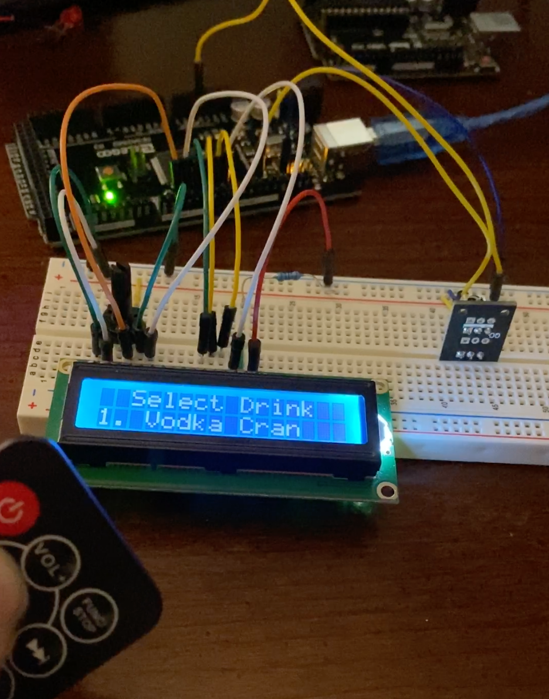
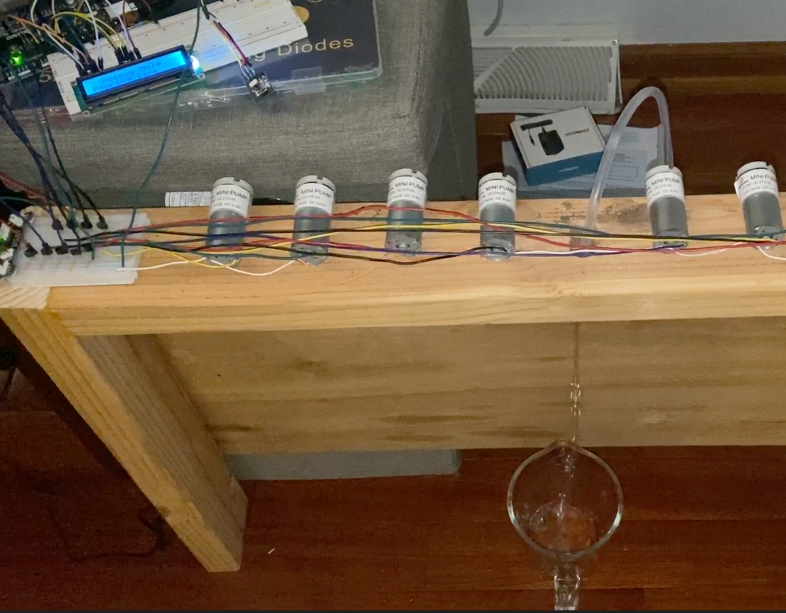
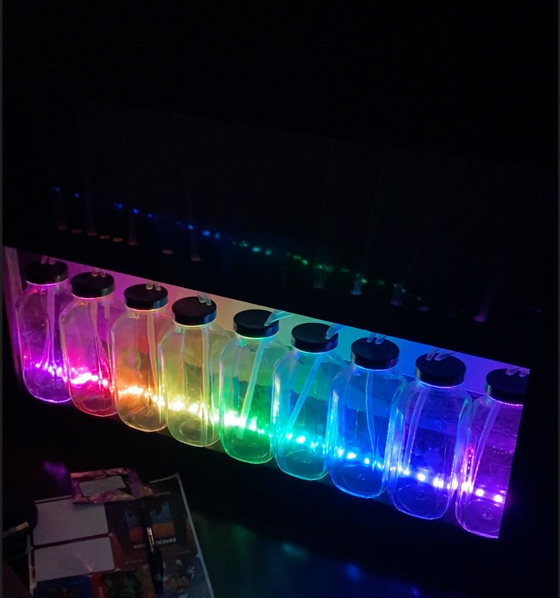

# robotic bartender

This project is a robotic bartender. This repository contains the arduino code that I use -- it is still a work in progress and the code needs cleaned up.

# Skills gained and used:
- Woodworking skills
- Soldering
- Controlling motors with arduino
- prototyping

# In progress:
- time the dispensing
- make lighting more attractive

# photos

Application interface developed

frame built and wired up

frame stained and added casing + metal background

bottles and tubing added to the frame

lights programmed and added

